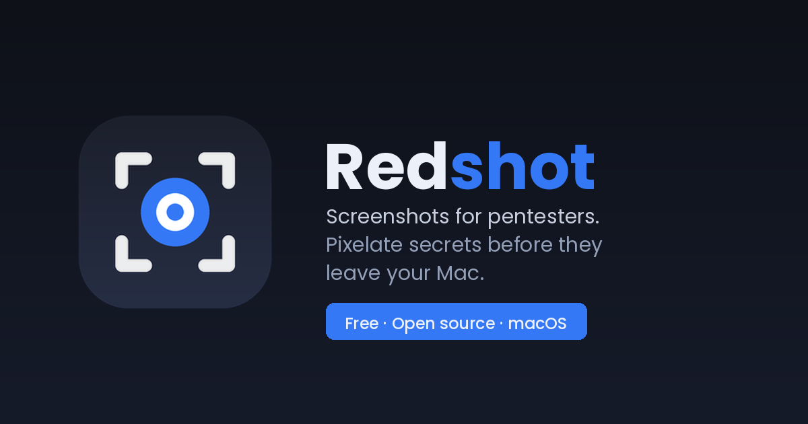

<p align="center"></p>

# Redshot

Historial de capturas y portapapeles para macOS, pensado para pentest.

En un engagement saco decenas de capturas y siempre acababa igual: capturar, abrir Vista Previa, tapar la contraseña, recortar, guardar con cualquier nombre, perderla en Descargas y buscarla semanas después para el informe. Redshot guarda cada captura y todo lo que copio en un solo sitio con búsqueda, abre un editor justo después de capturar para pixelar un secreto o poner una flecha antes de que salga de ahí, y no manda nada fuera del equipo.

Vive en la barra de menús. Sin icono en el Dock, sin cuentas, sin sincronización.

[English README](README.md)

## Qué hace

**Capturas.** Región, ventana o pantalla completa con un atajo global. Cada captura va al historial y al portapapeles.

**Un editor que se abre solo.** Flechas, líneas, rectángulos, elipses, texto, resaltado, recorte y pixelado de verdad (los píxeles se descartan, no es un desenfoque que se pueda revertir con un filtro). Al guardar, el original queda intacto y la versión editada se añade como elemento nuevo, que es lo que quieres cuando una captura es una evidencia.

**Historial de portapapeles.** Texto, enlaces, código, colores, imágenes y archivos, con la app de origen. Eliges algo y se pega directamente donde estabas.

**Búsqueda dentro de las imágenes.** El OCR de Vision pasa por cada captura, así que puedes buscar un hostname que viste en una terminal hace tres días.

**Cierto cuidado con lo que guarda.** Lo que un gestor de contraseñas marca como confidencial se ignora. Las apps que indiques se ignoran. El texto que parece una clave de API, una clave privada, un JWT o una tarjeta se descarta antes de tocar disco. Puedes pausar la captura con un clic.

Inglés y español, se cambia en ajustes.

Necesita macOS 14 o superior.

## Instalar

La vía rápida. Descarga el último release, lo deja en Aplicaciones, quita la cuarentena y lo abre:

```sh
curl -fsSL https://raw.githubusercontent.com/marcocarolasec/Redshot/main/Scripts/install.sh | bash
```

O baja el DMG de [Releases](../../releases) y arrástralo a Aplicaciones. No pago a Apple la notarización, así que la primera vez macOS protestará: Ajustes del Sistema → Privacidad y seguridad → "Abrir de todos modos". Si la abres desde el DMG o desde Descargas, la propia app se ofrece a moverse a Aplicaciones.

Al arrancar, una guía corta te lleva por los dos permisos: Grabación de pantalla (imprescindible para capturar) y Accesibilidad (opcional, solo para pegar directamente en la app activa).

## Atajos

```
⌃⌘S        capturar región (Espacio cambia a ventana, Esc cancela)
⌃⌘W        capturar ventana
⌃⌘F        capturar pantalla completa
⌃⌘V        abrir o cerrar el historial
⌃⌘1…9, 0   pegar el 1º…10º elemento más reciente
```

En el editor: ⇧ fuerza cuadrado, círculo o 45°, Supr borra la anotación seleccionada, ⌘Z / ⇧⌘Z deshacen y rehacen, ⌘S guarda.

## Compilarlo

```sh
git clone https://github.com/marcocarolasec/Redshot.git
cd Redshot
Scripts/build_app.sh
cp -R build/Redshot.app /Applications/
```

Es un paquete Swift normal, sin dependencias. `open Package.swift` funciona en Xcode; en VS Code con la extensión de Swift, ⇧⌘B compila, instala y relanza.

`Scripts/make_release.sh` genera el DMG y el zip. Al subir un tag `v*`, GitHub Actions los compila y los adjunta a un release.

La firma es ad-hoc: cada compilación cambia la firma y macOS puede volver a pedir Grabación de pantalla. Con un certificado de desarrollador el permiso se conserva: `CODESIGN_IDENTITY="Apple Development: Nombre (TEAM)" Scripts/build_app.sh`.

## Dónde guarda las cosas

```
~/Library/Application Support/Redshot/
  redshot.sqlite     metadatos
  images/            originales y miniaturas
```

Borra esa carpeta y la app se olvida de todo.

## Cómo está montado

`Sources/Redshot/`

- `App/` arranque en la barra de menús, atajos globales (Carbon, sin necesidad de Accesibilidad), preferencias, idiomas, el aviso de mover a Aplicaciones
- `Services/` sondeo del portapapeles, envoltorio de `screencapture`, OCR, simulación de pegado, heurísticas de contenido sensible
- `Storage/` un envoltorio fino sobre la API C de sqlite3 y el almacén de imágenes
- `Editor/` modelo de anotaciones, un renderizador CoreGraphics compartido por pantalla y exportación, y un lienzo AppKit
- `UI/` panel de historial, ajustes, guía inicial

Algunas decisiones. Uso `/usr/sbin/screencapture` en vez de ScreenCaptureKit porque te da la cruz y el selector de ventanas del sistema gratis y pide el mismo permiso. El portapapeles se sondea cada medio segundo porque macOS no notifica cambios en el pasteboard; es lo que hace cualquier gestor de portapapeles. El historial es un panel que no activa la app, para que la app en la que estabas siga con el foco y el ⌘V simulado le llegue a ella.

## Lo siguiente

Lo que quiero para mis propios informes, más o menos en orden: etiquetar capturas por engagement y hallazgo, exportar un conjunto con un manifiesto SHA-256, que el OCR marque credenciales e IPs y ofrezca pixelarlas de un clic, y exportar directamente a Markdown o docx con nombres de fichero consistentes.

## Licencia

MIT.
