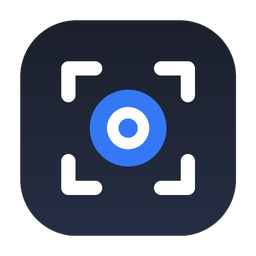

<p align="center"></p>

# Redshot

Screenshot and clipboard history for macOS, made for pentest work.

I take a lot of screenshots during an engagement and I got tired of the same routine: capture, open Preview, blur the password, crop, save with some name, lose it in Downloads, then dig it out weeks later for the report. Redshot keeps every capture and everything I copy in one searchable place, opens an editor right after each screenshot so I can pixelate a secret or add an arrow before it goes anywhere, and never sends anything off the machine.

It's a menu bar app. No Dock icon, no accounts, no sync.

[Versión en español](README.es.md)

## What you get

**Screenshots.** Area, window or full screen with a global shortcut. Every capture lands in the history and on the clipboard.

**An editor that opens by itself.** Arrows, lines, boxes, ellipses, text, highlight, crop, and real pixelation (the pixels are actually thrown away, it's not a blur you can undo with a filter). Saving keeps the original untouched and adds the edited version as a new item, which matters when a screenshot is evidence.

**Clipboard history.** Text, links, code, colors, images and files, tagged with the app they came from. Pick something and it gets pasted straight into whatever you were using.

**Search inside images.** Apple's Vision OCR runs on every screenshot, so you can search for a hostname you saw in a terminal three days ago.

**Some care about what it stores.** Anything a password manager marks as concealed is skipped. Apps you list are ignored. Text that looks like an API key, a private key, a JWT or a card number is dropped before it hits disk. You can pause capture with one click.

English and Spanish, switchable in settings.

Needs macOS 14 or newer.

## Install

The quick way. It downloads the latest release, puts it in Applications, clears the quarantine flag and opens it:

```sh
curl -fsSL https://raw.githubusercontent.com/marcocarolasec/Redshot/main/Scripts/install.sh | bash
```

Or grab the DMG from [Releases](../../releases) and drag it to Applications. I don't pay Apple for notarization, so the first time you open it macOS will complain. Go to System Settings → Privacy & Security and click "Open Anyway". If you launch it from the DMG or from Downloads, it offers to move itself to Applications.

On first run a short guide walks you through the two permissions: Screen Recording (needed to capture anything) and Accessibility (optional, only for pasting directly into the frontmost app).

## Shortcuts

```
⌃⌘S        capture an area (Space switches to window mode, Esc cancels)
⌃⌘W        capture a window
⌃⌘F        capture the whole screen
⌃⌘V        open or close the history
⌃⌘1…9, 0   paste the 1st…10th most recent item
```

In the editor: hold ⇧ to constrain shapes and lines, Delete removes the selected annotation, ⌘Z / ⇧⌘Z undo and redo, ⌘S saves.

## Building it yourself

```sh
git clone https://github.com/marcocarolasec/Redshot.git
cd Redshot
Scripts/build_app.sh
cp -R build/Redshot.app /Applications/
```

It's a plain Swift package, no dependencies. `open Package.swift` works in Xcode; in VS Code with the Swift extension, ⇧⌘B builds, installs and relaunches.

`Scripts/make_release.sh` produces the DMG and the zip. Pushing a `v*` tag builds them on GitHub Actions and attaches them to a release.

Builds are ad-hoc signed. That means every rebuild has a different signature and macOS may ask for Screen Recording again. If you have a developer certificate, pass it and the permission sticks: `CODESIGN_IDENTITY="Apple Development: Name (TEAM)" Scripts/build_app.sh`.

## Where things live

```
~/Library/Application Support/Redshot/
  redshot.sqlite     metadata
  images/            originals and thumbnails
```

Delete that folder and the app forgets everything.

## How it's put together

`Sources/Redshot/`

- `App/` the menu bar entry point, global hotkeys (Carbon, no Accessibility needed for those), preferences, localization, the move-to-Applications prompt
- `Services/` clipboard polling, `screencapture` wrapper, OCR, paste simulation, the sensitive content heuristics
- `Storage/` a thin wrapper over the sqlite3 C API and the image store
- `Editor/` annotation model, a CoreGraphics renderer shared by screen and export, and an AppKit canvas
- `UI/` history panel, settings, onboarding

A few choices worth explaining. I use `/usr/sbin/screencapture` instead of ScreenCaptureKit because it gives you the system's own crosshair and window picker for free and asks for the same permission. The clipboard is polled every half second because macOS has no change notification for the pasteboard; that's what every clipboard manager does. The history is a non-activating panel so the app you were in keeps focus and the simulated ⌘V lands there.

## What's next

Things I want for my own reports, roughly in order: tag captures by engagement and finding, export a set of them with a SHA-256 manifest, let the OCR flag credentials and IPs and offer to pixelate them in one click, and export straight to Markdown or docx with consistent file names.

## License

MIT.
